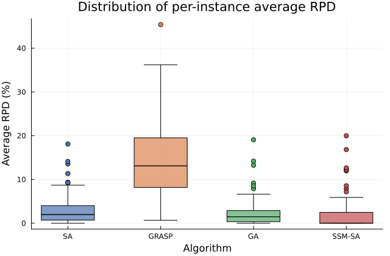

# Supplementary Material: RPD Results per Instance

This file accompanies the paper *Scheduling rubber shoe sole production on a parallel machine with synchronized interruptions*.

This statistical supplementary material was prepared in response to the reviewer's request to report average RPD performance and provide a formal statistical analysis of the stochastic solution methods.


**RPD** (Relative Percentage Deviation) is defined as:

```
RPD = (cost − BKS) / BKS × 100
```

where **BKS** (Best Known Solution) is the minimum feasible cost achieved by any method across all runs for that instance.

The summary and per-instance tables below report average performance, rather than only best-so-far outcomes, for the stochastic methods requested by the reviewer.

- `—` for SSM-SA: instance not executed (computationally infeasible for repeated runs).
- `—` for MILP: Gurobi did not find a proven optimal solution within the time limit (lower bound reported in the paper; feasible value excluded from analysis).

## Summary Statistics (120 instances, both β values)

This section provides an aggregate view of average RPD across the full benchmark set.

| Algorithm | n | Mean RPD | Std RPD | Median RPD | Min RPD | Max RPD |
|-----------|--:|--------:|--------:|-----------:|--------:|--------:|
| SA | 120 | 2.9026 | 3.1582 | 1.9721 | 0.0000 | 18.0956 |
| GRASP | 120 | 14.2236 | 8.1779 | 13.1146 | 0.6620 | 45.3920 |
| GA | 120 | 2.2915 | 2.9763 | 1.4669 | 0.0000 | 19.0654 |
| SSM-SA | 109 | 1.8756 | 3.6712 | 0.0000 | 0.0000 | 19.9778 |
| MILP | 94 | 0.0000 | 0.0000 | 0.0000 | 0.0000 | 0.0000 |

## Per-Instance Average RPD

For the stochastic heuristics, each row reports the mean and standard deviation over repeated runs for that instance. For MILP and the deterministic baseline, the reported RPD is the single available value for that instance.

| Instance | β | BKS | SA avg | SA std | GRASP avg | GRASP std | GA avg | GA std | SSM-SA | MILP |
|----------|:-:|----:|-------:|-------:|----------:|----------:|-------:|-------:|-------:|-----:|
| H_O1_#1_2p | 3 | 215 | 0.1362 | 0.3012 | 4.1828 | 3.3093 | 0.0140 | 0.0797 | 0.0000 | 0.0000 |
| H_O1_#1_3p | 3 | 146 | 0.3217 | 0.9345 | 13.0470 | 9.6777 | 0.0000 | 0.0000 | 0.0000 | 0.0000 |
| H_O1_#1_4p | 3 | 119 | 0.0279 | 0.2643 | 13.4979 | 10.3628 | 0.0252 | 0.2521 | 0.0000 | 0.0000 |
| H_O1_#1_5p | 3 | 104 | 2.8846 | 0.0000 | 11.9725 | 13.1076 | 2.8846 | 0.0000 | — | 0.0000 |
| H_O2_#1_2p | 3 | 2188 | 0.5543 | 0.4915 | 4.1032 | 4.4104 | 0.0000 | 0.0000 | 0.0000 | 0.0000 |
| H_O2_#1_3p | 3 | 1479 | 0.2637 | 0.6852 | 11.4872 | 10.4315 | 0.0000 | 0.0000 | 0.2705 | 0.0000 |
| H_O2_#1_4p | 3 | 1264 | 0.0000 | 0.0000 | 2.9684 | 6.6025 | 0.0000 | 0.0000 | 0.0000 | 0.0000 |
| H_O2_#1_5p | 3 | 1264 | 0.0000 | 0.0000 | 0.6620 | 3.1014 | 0.0000 | 0.0000 | — | 0.0000 |
| H_O3_#1_2p | 3 | 643 | 0.2071 | 0.2965 | 5.2985 | 3.9755 | 0.0793 | 0.1761 | 0.4666 | 0.0000 |
| H_O3_#1_3p | 3 | 443 | 0.5101 | 0.6955 | 10.3304 | 5.8032 | 0.0677 | 0.2694 | 1.3544 | 0.0000 |
| H_O3_#1_4p | 3 | 341 | 0.9446 | 1.1639 | 13.1822 | 6.6894 | 0.6305 | 0.1466 | 3.2258 | 0.0000 |
| H_O3_#1_5p | 3 | 308 | 1.0027 | 0.1616 | 11.9589 | 6.9045 | 0.9740 | 0.0000 | — | 0.0000 |
| H_O1_#2_2p | 3 | 213 | 1.3021 | 0.5508 | 6.1424 | 3.0092 | 1.0986 | 0.5306 | 0.0000 | 0.0000 |
| H_O1_#2_3p | 3 | 146 | 0.9801 | 1.5870 | 14.4454 | 7.3202 | 0.3082 | 0.7374 | 0.0000 | 0.0000 |
| H_O1_#2_4p | 3 | 118 | 1.2735 | 1.3148 | 19.4621 | 10.1756 | 0.5847 | 0.8826 | 3.3898 | 0.0000 |
| H_O1_#2_5p | 3 | 104 | 2.9165 | 0.3024 | 17.4279 | 11.4065 | 2.8846 | 0.0000 | — | 0.0000 |
| H_O2_#2_2p | 3 | 2183 | 0.1696 | 0.1370 | 3.6039 | 3.5568 | 0.0609 | 0.0890 | 0.0000 | 0.0000 |
| H_O2_#2_3p | 3 | 1467 | 0.4930 | 0.2872 | 10.7239 | 8.7594 | 0.4117 | 0.2311 | 0.0682 | 0.0000 |
| H_O2_#2_4p | 3 | 1120 | 1.0995 | 0.7840 | 15.3119 | 10.1848 | 1.0696 | 0.7528 | 7.8571 | 0.0000 |
| H_O2_#2_5p | 3 | 991 | 0.3077 | 0.0595 | 11.3466 | 10.7776 | 0.3027 | 0.0861 | — | 0.0000 |
| H_O3_#2_2p | 3 | 643 | 0.2612 | 0.2687 | 4.7099 | 2.8968 | 0.1866 | 0.2297 | 0.0000 | 0.0000 |
| H_O3_#2_3p | 3 | 435 | 1.7591 | 0.8410 | 11.0616 | 5.5326 | 1.2920 | 0.5122 | 0.6897 | 0.0000 |
| H_O3_#2_4p | 3 | 332 | 1.9936 | 1.6103 | 16.3111 | 6.9774 | 1.8012 | 1.0573 | 0.0000 | 0.0000 |
| H_O3_#2_5p | 3 | 280 | 3.9897 | 3.7552 | 20.8532 | 7.8381 | 1.7643 | 1.6416 | 5.7143 | 0.0000 |
| H_O1_#3_2p | 3 | 213 | 1.9506 | 0.6818 | 6.9379 | 2.8226 | 1.5493 | 0.3021 | 0.0000 | 0.0000 |
| H_O1_#3_3p | 3 | 146 | 2.8495 | 1.9050 | 15.5584 | 6.5128 | 1.9315 | 1.2057 | 0.0000 | 0.0000 |
| H_O1_#3_4p | 3 | 114 | 5.8447 | 1.9400 | 23.4649 | 10.3612 | 5.2281 | 1.5164 | 4.3860 | 0.0000 |
| H_O1_#3_5p | 3 | 104 | 4.0799 | 1.4884 | 19.6982 | 10.8363 | 4.1538 | 1.4391 | 0.0000 | 0.0000 |
| H_O2_#3_2p | 3 | 2183 | 0.2192 | 0.1212 | 3.3828 | 3.2264 | 0.1438 | 0.0631 | 0.0000 | 0.0000 |
| H_O2_#3_3p | 3 | 1464 | 0.8382 | 0.2866 | 10.6695 | 8.8092 | 0.6728 | 0.2049 | 0.3415 | 0.0000 |
| H_O2_#3_4p | 3 | 1107 | 2.2084 | 0.8790 | 15.4101 | 10.3326 | 2.0867 | 0.7409 | 4.4264 | 0.0000 |
| H_O2_#3_5p | 3 | 991 | 0.5653 | 0.1078 | 10.3662 | 11.9509 | 0.5843 | 0.0986 | 0.3027 | 0.0000 |
| H_O3_#3_2p | 3 | 643 | 0.5258 | 0.2635 | 4.9443 | 3.0948 | 0.4495 | 0.1623 | 0.0000 | — |
| H_O3_#3_3p | 3 | 435 | 2.0499 | 0.7750 | 11.3761 | 5.4577 | 1.7701 | 0.4774 | 0.0000 | — |
| H_O3_#3_4p | 3 | 331 | 2.9394 | 1.3488 | 16.0960 | 7.8472 | 2.6465 | 1.0693 | 2.4169 | 0.0000 |
| H_O3_#3_5p | 3 | 272 | 5.7889 | 2.6608 | 23.9737 | 8.4672 | 5.1618 | 1.3424 | 5.8824 | 0.0000 |
| H_O1_#4_2p | 3 | 213 | 1.7249 | 0.6997 | 7.6748 | 3.0407 | 1.4648 | 0.4019 | 0.0000 | 0.0000 |
| H_O1_#4_3p | 3 | 146 | 2.3310 | 1.9126 | 14.9496 | 5.6946 | 1.3630 | 1.2749 | 0.0000 | 0.0000 |
| H_O1_#4_4p | 3 | 114 | 4.8851 | 2.0304 | 23.0933 | 7.5108 | 4.6754 | 1.4054 | 2.6316 | 0.0000 |
| H_O1_#4_5p | 3 | 97 | 7.3532 | 3.2116 | 27.1478 | 9.6031 | 6.6289 | 2.4222 | 12.3711 | 0.0000 |
| H_O2_#4_2p | 3 | 2183 | 0.2040 | 0.1062 | 3.4356 | 3.1847 | 0.1035 | 0.0882 | 0.0000 | 0.0000 |
| H_O2_#4_3p | 3 | 1464 | 0.7034 | 0.3270 | 10.1017 | 8.1173 | 0.6455 | 0.2304 | 0.0000 | — |
| H_O2_#4_4p | 3 | 1106 | 1.3328 | 0.7521 | 15.2671 | 9.0904 | 1.5018 | 0.6014 | 1.4467 | 0.0000 |
| H_O2_#4_5p | 3 | 901 | 2.0597 | 0.8959 | 25.4016 | 14.2242 | 2.5605 | 1.1235 | 19.9778 | 0.0000 |
| H_O3_#4_2p | 3 | 643 | 0.4623 | 0.2745 | 4.9302 | 2.7371 | 0.4199 | 0.2020 | 0.0000 | — |
| H_O3_#4_3p | 3 | 435 | 1.6968 | 0.7439 | 10.6098 | 4.9328 | 1.4690 | 0.5071 | 0.0000 | — |
| H_O3_#4_4p | 3 | 332 | 2.4180 | 1.3848 | 15.7484 | 6.9171 | 2.2982 | 0.9627 | 0.0000 | — |
| H_O3_#4_5p | 3 | 271 | 5.6635 | 3.1327 | 23.6137 | 6.9693 | 4.4428 | 1.1442 | 2.9520 | 0.0000 |
| H_O1_#5_2p | 3 | 213 | 2.5082 | 0.7641 | 8.1442 | 2.7923 | 2.0892 | 0.5982 | 0.0000 | — |
| H_O1_#5_3p | 3 | 146 | 4.6091 | 1.9902 | 17.7036 | 5.2064 | 3.3699 | 1.6076 | 0.0000 | 0.0000 |
| H_O1_#5_4p | 3 | 111 | 9.2131 | 2.4208 | 26.8018 | 7.5069 | 9.1712 | 1.5961 | 2.7027 | 0.0000 |
| H_O1_#5_5p | 3 | 92 | 13.5239 | 3.6544 | 33.7711 | 8.8600 | 14.1848 | 2.5823 | 11.9565 | 0.0000 |
| H_O2_#5_2p | 3 | 2183 | 0.2943 | 0.1150 | 3.1815 | 2.7750 | 0.2263 | 0.0892 | 0.0000 | — |
| H_O2_#5_3p | 3 | 1464 | 0.8389 | 0.3284 | 9.4144 | 6.8296 | 0.7862 | 0.2393 | 0.0000 | — |
| H_O2_#5_4p | 3 | 1109 | 1.5010 | 1.0507 | 14.8169 | 9.0502 | 1.4229 | 0.5737 | 0.9017 | — |
| H_O2_#5_5p | 3 | 901 | 2.0223 | 1.0053 | 20.2044 | 12.0645 | 2.6659 | 1.0208 | 5.2164 | — |
| H_O3_#5_2p | 3 | 643 | 0.7535 | 0.3110 | 4.5101 | 2.4212 | 0.7325 | 0.2504 | 0.0000 | — |
| H_O3_#5_3p | 3 | 435 | 2.3966 | 0.7107 | 9.7781 | 4.3700 | 2.1057 | 0.5080 | 0.0000 | — |
| H_O3_#5_4p | 3 | 332 | 3.2334 | 1.3706 | 16.4219 | 7.0520 | 2.9970 | 0.9085 | 0.9036 | — |
| H_O3_#5_5p | 3 | 269 | 6.5251 | 2.2974 | 23.5130 | 8.0240 | 6.3941 | 1.1979 | 4.0892 | 0.0000 |
| H_O1_#1_2p | 6 | 233 | 0.6876 | 1.2541 | 6.1516 | 3.3206 | 0.0000 | 0.0000 | 0.0000 | 0.0000 |
| H_O1_#1_3p | 6 | 164 | 3.6523 | 3.7159 | 15.3371 | 8.5901 | 0.0000 | 0.0000 | 0.0000 | 0.0000 |
| H_O1_#1_4p | 6 | 137 | 0.0223 | 0.3128 | 16.3676 | 10.3600 | 0.0000 | 0.0000 | 0.0000 | 0.0000 |
| H_O1_#1_5p | 6 | 119 | 5.0420 | 0.0000 | 15.7855 | 12.5030 | 5.0420 | 0.0000 | — | 0.0000 |
| H_O2_#1_2p | 6 | 2212 | 0.7358 | 0.7017 | 3.8185 | 4.0031 | 0.0000 | 0.0000 | 0.0000 | 0.0000 |
| H_O2_#1_3p | 6 | 1503 | 0.7051 | 0.9808 | 9.6367 | 9.9134 | 0.0000 | 0.0000 | 0.0000 | 0.0000 |
| H_O2_#1_4p | 6 | 1288 | 0.0000 | 0.0000 | 5.7901 | 10.9642 | 0.0000 | 0.0000 | 0.0000 | 0.0000 |
| H_O2_#1_5p | 6 | 1288 | 0.0000 | 0.0000 | 0.8211 | 3.7488 | 0.0000 | 0.0000 | — | 0.0000 |
| H_O3_#1_2p | 6 | 664 | 0.7330 | 0.8042 | 5.3485 | 3.0024 | 0.0181 | 0.1271 | 0.0000 | 0.0000 |
| H_O3_#1_3p | 6 | 470 | 0.7056 | 1.1492 | 9.1283 | 5.3355 | 0.0000 | 0.0000 | 0.4255 | 0.0000 |
| H_O3_#1_4p | 6 | 362 | 3.2755 | 2.5503 | 13.4131 | 7.4151 | 1.6575 | 0.0000 | 4.9724 | 0.0000 |
| H_O3_#1_5p | 6 | 332 | 2.6832 | 1.9640 | 12.0733 | 7.0378 | 1.2048 | 0.0000 | — | 0.0000 |
| H_O1_#2_2p | 6 | 233 | 1.8109 | 1.4493 | 8.1933 | 2.6089 | 0.1116 | 0.4508 | 0.0000 | 0.0000 |
| H_O1_#2_3p | 6 | 164 | 2.7781 | 3.4660 | 18.6780 | 7.2391 | 0.2927 | 0.9975 | 0.0000 | 0.0000 |
| H_O1_#2_4p | 6 | 137 | 1.4338 | 1.9675 | 19.8652 | 8.4027 | 0.3942 | 0.9476 | 0.0000 | 0.0000 |
| H_O1_#2_5p | 6 | 119 | 5.1578 | 1.0306 | 22.8992 | 10.2566 | 5.0420 | 0.0000 | — | 0.0000 |
| H_O2_#2_2p | 6 | 2207 | 0.2559 | 0.2117 | 4.3725 | 4.1948 | 0.0199 | 0.0629 | 0.0000 | 0.0000 |
| H_O2_#2_3p | 6 | 1492 | 0.6049 | 0.4989 | 10.4916 | 8.2155 | 0.3505 | 0.1636 | 0.0000 | 0.0000 |
| H_O2_#2_4p | 6 | 1144 | 1.5373 | 1.3361 | 15.4168 | 9.7429 | 0.8654 | 0.4889 | 5.6818 | 0.0000 |
| H_O2_#2_5p | 6 | 1012 | 0.7315 | 1.4256 | 12.5069 | 10.6766 | 0.5692 | 0.1168 | — | 0.0000 |
| H_O3_#2_2p | 6 | 664 | 0.7830 | 0.6043 | 6.1716 | 3.0760 | 0.4443 | 0.2875 | 0.0000 | 0.0000 |
| H_O3_#2_3p | 6 | 456 | 3.3130 | 1.5375 | 13.2279 | 5.5191 | 2.0965 | 0.6503 | 0.0000 | 0.0000 |
| H_O3_#2_4p | 6 | 350 | 3.9913 | 3.0880 | 19.8214 | 6.9847 | 3.0057 | 1.3429 | 1.7143 | 0.0000 |
| H_O3_#2_5p | 6 | 304 | 7.4080 | 4.5105 | 20.8470 | 7.7773 | 1.7138 | 1.4345 | 8.5526 | 0.0000 |
| H_O1_#3_2p | 6 | 233 | 3.2649 | 1.4040 | 11.0962 | 3.3422 | 2.3004 | 1.0052 | 0.0000 | 0.0000 |
| H_O1_#3_3p | 6 | 164 | 5.1456 | 3.5982 | 20.1643 | 5.9349 | 2.8963 | 1.8776 | 0.0000 | 0.0000 |
| H_O1_#3_4p | 6 | 132 | 7.4753 | 2.8802 | 29.4876 | 9.2076 | 6.4242 | 1.7312 | 3.7879 | 0.0000 |
| H_O1_#3_5p | 6 | 119 | 6.3111 | 2.5820 | 27.3401 | 9.6889 | 6.2521 | 2.1642 | 0.0000 | 0.0000 |
| H_O2_#3_2p | 6 | 2207 | 0.3992 | 0.1767 | 4.0625 | 3.6511 | 0.2460 | 0.0784 | 0.0000 | 0.0000 |
| H_O2_#3_3p | 6 | 1488 | 1.2529 | 0.4404 | 10.6766 | 7.8885 | 0.8327 | 0.2022 | 0.3360 | 0.0000 |
| H_O2_#3_4p | 6 | 1131 | 3.0305 | 1.5738 | 17.2236 | 10.7719 | 2.1202 | 0.5576 | 4.3324 | 0.0000 |
| H_O2_#3_5p | 6 | 1012 | 1.0557 | 0.2532 | 9.4875 | 10.6024 | 1.1107 | 0.1962 | 0.5929 | 0.0000 |
| H_O3_#3_2p | 6 | 664 | 1.3677 | 0.4466 | 6.1642 | 2.6459 | 1.0407 | 0.3907 | 0.0000 | — |
| H_O3_#3_3p | 6 | 456 | 3.7918 | 1.5109 | 13.0315 | 5.2110 | 2.8311 | 0.5980 | 0.0000 | — |
| H_O3_#3_4p | 6 | 350 | 5.5423 | 2.8431 | 18.3929 | 6.8020 | 3.9914 | 1.1864 | 1.7143 | 0.0000 |
| H_O3_#3_5p | 6 | 296 | 9.3595 | 4.8032 | 24.7959 | 7.5605 | 5.6250 | 1.4400 | 3.3784 | 0.0000 |
| H_O1_#4_2p | 6 | 233 | 3.0787 | 1.4836 | 10.8190 | 2.7143 | 1.8970 | 1.1218 | 0.0000 | 0.0000 |
| H_O1_#4_3p | 6 | 164 | 4.6945 | 3.5354 | 20.6216 | 5.2422 | 1.9817 | 2.0915 | 0.0000 | 0.0000 |
| H_O1_#4_4p | 6 | 132 | 7.0462 | 2.9869 | 28.0198 | 8.7641 | 5.5909 | 1.4518 | 2.2727 | 0.0000 |
| H_O1_#4_5p | 6 | 115 | 8.6823 | 3.2001 | 31.0085 | 7.8945 | 7.8783 | 1.6388 | 12.1739 | 0.0000 |
| H_O2_#4_2p | 6 | 2207 | 0.3334 | 0.1912 | 3.5465 | 2.8252 | 0.1427 | 0.1364 | 0.0000 | 0.0000 |
| H_O2_#4_3p | 6 | 1488 | 1.0931 | 0.8262 | 10.1656 | 7.2962 | 0.7728 | 0.2204 | 0.0000 | — |
| H_O2_#4_4p | 6 | 1129 | 2.4051 | 1.8972 | 16.1543 | 9.5984 | 1.8468 | 0.5695 | 2.4801 | 0.0000 |
| H_O2_#4_5p | 6 | 926 | 2.9417 | 1.9284 | 24.2501 | 12.3039 | 2.7516 | 0.8738 | 12.6350 | 0.0000 |
| H_O3_#4_2p | 6 | 664 | 1.1564 | 0.6339 | 6.5083 | 2.8827 | 1.0151 | 0.4268 | 0.0000 | — |
| H_O3_#4_3p | 6 | 456 | 3.2279 | 1.3167 | 12.7711 | 4.8808 | 2.5022 | 0.6045 | 0.0000 | — |
| H_O3_#4_4p | 6 | 350 | 4.7872 | 2.8531 | 18.9127 | 6.8868 | 4.0829 | 1.1546 | 0.0000 | 0.0000 |
| H_O3_#4_5p | 6 | 292 | 9.2868 | 4.8037 | 25.7967 | 8.2780 | 5.9863 | 1.7621 | — | 0.0000 |
| H_O1_#5_2p | 6 | 233 | 4.2918 | 1.5484 | 12.5000 | 2.6723 | 3.0687 | 1.0178 | 0.0000 | 0.0000 |
| H_O1_#5_3p | 6 | 164 | 7.1366 | 3.3090 | 23.2173 | 5.2245 | 5.1220 | 2.0601 | 0.0000 | 0.0000 |
| H_O1_#5_4p | 6 | 126 | 14.1197 | 3.9007 | 36.2213 | 8.6353 | 13.2540 | 2.1830 | 4.7619 | 0.0000 |
| H_O1_#5_5p | 6 | 107 | 18.0956 | 4.6654 | 45.3920 | 9.1032 | 19.0654 | 2.6633 | 16.8224 | 0.0000 |
| H_O2_#5_2p | 6 | 2207 | 0.5181 | 0.2021 | 3.9036 | 3.0127 | 0.3598 | 0.1291 | 0.0000 | — |
| H_O2_#5_3p | 6 | 1488 | 1.2577 | 0.4339 | 9.7656 | 7.0704 | 1.0323 | 0.2076 | 0.0000 | — |
| H_O2_#5_4p | 6 | 1135 | 2.2134 | 1.7756 | 17.5251 | 9.7979 | 1.7101 | 0.5171 | 0.0881 | — |
| H_O2_#5_5p | 6 | 933 | 2.2902 | 1.9155 | 20.3719 | 12.8265 | 2.1736 | 0.7985 | 7.1811 | — |
| H_O3_#5_2p | 6 | 664 | 1.6920 | 0.6108 | 6.4466 | 2.2773 | 1.6160 | 0.4610 | 0.4518 | — |
| H_O3_#5_3p | 6 | 456 | 4.0716 | 1.2605 | 13.1990 | 4.8562 | 3.5110 | 0.7393 | 0.0000 | — |
| H_O3_#5_4p | 6 | 354 | 4.9824 | 2.5844 | 17.9065 | 7.0571 | 4.0678 | 1.3972 | 0.0000 | — |
| H_O3_#5_5p | 6 | 290 | 11.3494 | 4.8678 | 27.5168 | 7.1500 | 8.5172 | 1.5588 | 4.1379 | 0.0000 |

---

## Statistical Analysis

The statistical analysis follows the methodology of Derrac et al. (2011), using nonparametric tests appropriate for comparing multiple heuristics over a set of benchmark instances.
This section addresses the reviewer's request to assess whether the observed differences are statistically significant.

**Dataset:** 109 instances for which all four heuristics (SA, SSM-SA, GRASP, GA) produced valid results (SSM-SA was inapplicable for 11 instances).

### Normality (Shapiro–Wilk test)

Normality was checked first to determine whether parametric or nonparametric tests were appropriate.

| Algorithm | n | W statistic | p-value | Normal (p ≥ 0.05) |
|-----------|--:|------------:|--------:|:-----------------:|
| SA | 120 | 0.7905 | < 0.001 | No |
| GRASP | 120 | 0.9559 | < 0.001 | No |
| GA | 120 | 0.7148 | < 0.001 | No |
| SSM-SA | 109 | 0.5847 | < 0.001 | No |

All four RPD distributions are non-normal, justifying the use of nonparametric tests.

### Friedman Test (overall comparison)

| Statistic | Value |
|-----------|------:|
| n instances | 109 |
| χ² | 255.52 |
| p-value | < 0.001 |
| Significant (p < 0.05) | Yes |

### Pairwise Wilcoxon Signed-Rank Tests (Bonferroni corrected, α = 0.05/6)

These post hoc comparisons identify which pairs of heuristics differ after controlling for multiple testing.

| Pair (A vs B) | W statistic | p-value (raw) | p-value (Bonf) | Significant | Effect size (r) | Magnitude |
|---------------|------------:|--------------:|---------------:|:-----------:|----------------:|:---------:|
| SA vs GRASP | 0.0 | < 0.001 | < 0.001 | Yes | 1.000 | large |
| SA vs GA | 331.0 | < 0.001 | < 0.001 | Yes | 0.885 | large |
| SA vs SSM-SA | 1217.0 | < 0.001 | < 0.001 | Yes | 0.579 | large |
| GRASP vs GA | 0.0 | < 0.001 | < 0.001 | Yes | 1.000 | large |
| GRASP vs SSM-SA | 0.0 | < 0.001 | < 0.001 | Yes | 1.000 | large |
| GA vs SSM-SA | 1452.0 | < 0.001 | 1.35 × 10⁻³ | Yes | 0.425 | medium |

All six pairwise comparisons are statistically significant after Bonferroni correction. Effect sizes are large for all pairs except GA vs SSM-SA (medium, r = 0.42), indicating that while GA and SSM-SA differ significantly, the practical difference is smaller than the other pairs.

### RPD Boxplot
A boxplot of RPD distributions across the four heuristics is available is



